# ENPP-family selectivity counter-screen for ENPP1 oral inhibitors

A structure-based **paralog-selectivity triage** of five candidate ENPP1
inhibitors against the two closest human paralogs, **ENPP2 / autotaxin** and
**ENPP3**. The analysis reverses a naïve affinity ranking: the compound that
docks *best* into ENPP1 is the *least* selective, because its potency comes from
chelating the catalytic zinc — the one feature every ENPP shares.

> **This is a computational methods demonstration, not a drug.** Every number
> here is a *prediction* (ChEMBL bioactivity + docking + structural analysis).
> There is **no wet-lab data**: no measured IC50, no cellular assay, no PK, no
> tox. See [**DISCLAIMER**](#disclaimer) before citing anything.

---

## TL;DR — the finding

| Lead | Warhead | pChEMBL | QED | ENPP1 | ENPP2 | ENPP3 | worst margin [95% CI] | verdict |
|------|---------|--------:|----:|------:|------:|------:|-------------:|---------|
| CHEMBL6149286 | hydroxamate | 9.20 | 0.50 | −9.2 | −10.0 | **−11.0** | **−1.77** [−1.82,−1.72] | anti-selective ✗ |
| CHEMBL6174154 | hydroxamate | 9.70 | 0.56 | −8.9 | −8.9 | **−10.2** | **−1.31** [−1.36,−1.27] | anti-selective ✗ |
| TZV (native)  | sulfamide  | — | — | −8.8 | −8.5 | −10.0 | −1.12 [−1.19,−1.05] | ATP-site ref |
| CHEMBL5555976 | sulfonamide | 9.28 | 0.52 | −8.2 | −8.2 | −7.7 | +0.03 [−0.06,+0.11] | indistinguishable |
| **CHEMBL5915707** | **sulfamide** | 9.30 | **0.73** | −7.9 | −6.8 | −7.5 | **+0.42** [+0.39,+0.45] | **ENPP1-preferring ✓** |
| **CHEMBL5826130** | **sulfamide** | 9.66 | **0.73** | −7.8 | −7.3 | −7.7 | **+0.12** [+0.11,+0.14] | **ENPP1-preferring ✓** |

*Affinities are **means of 42 independent docking runs** (seeds 1–20, 42;
smina, matched catalytic-Zn box), in kcal/mol. Margin = paralog − ENPP1;
positive ⇒ prefers ENPP1. Brackets are **95% bootstrap CIs** (10k resamples)
on the worst-case (least-selective) paralog margin; a verdict is called only
when the CI excludes 0.*

**Bottom line:** the prior consensus-docking winner — the hydroxamate
**CHEMBL6149286** — is **anti-selective**: it binds ENPP3 (−11.0) and ENPP2
(−10.0) *better* than ENPP1 (−9.2), and the effect is far outside docking noise
(margin −1.77, CI [−1.82,−1.72]). Both hydroxamates carry this liability. The
recommended nomination is the sulfamide **CHEMBL5826130** (backup
**CHEMBL5915707**): both are **statistically ENPP1-preferring** once the margin
is resolved against a 42-seed noise floor. Note the trade-off the replicates
expose — **5915707 has the larger, cleaner selectivity margin (+0.42 vs +0.12)**,
while **5826130 leads on potency (pChEMBL 9.66) and ties on developability (QED
0.73)** and draws the strongest orthogonal structural support (see below). The
two are co-nominated; if a single compound must advance, 5826130 is favored on
the potency/developability/structure composite and 5915707 is the
selectivity-first alternative. Both sit on the clinically validated sulfamide
chemotype and avoid the hydroxamate's Ames/mutagenicity alert.

> **Note on margin magnitude.** These margins (+0.1 to +0.4 kcal/mol) are
> *statistically* resolved but *pharmacologically small* — they establish
> **direction**, not fold-selectivity. The literature bar (ISM5939: >3,400×
> ENPP3) will require medicinal-chemistry optimization of the margin, not just
> selection among existing leads. See the analog-design campaign in
> [`analysis/`](analysis/) for a first attempt at widening it.

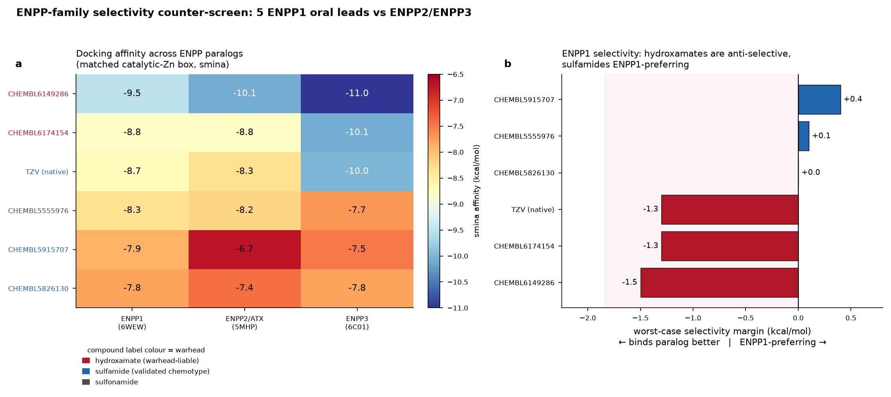

---

## Why the ranking flips

The hydroxamate warhead is a strong, geometry-tolerant **bidentate Zn²⁺
chelator**. That is exactly what makes it top the raw-affinity docking *and*
what makes it non-selective: the catalytic bimetal Zn center is the single most
conserved feature of the whole ENPP family, so a ligand whose binding is
dominated by Zn chelation cannot tell ENPP1 from ENPP2/3. The sulfamide is a
weaker, more directional Zn-interacting group that earns more of its affinity
from the paralog-divergent pocket walls — a lower raw score, but selectivity
by construction.

**Structure-based selection must optimize the ENPP1-minus-paralog *margin*, not
the absolute score.**

---

## The structural basis: ENPP3 is the hard problem

Superposing the three catalytic pockets (anchor Cα RMSD **0.15–0.23 Å**) over
the 14 residues within 6 Å of the bimetal Zn:

- **ENPP3 is identical to ENPP1 at all 14 core pocket positions** (100%
  identity). This reproduces, from an independent structure, the published
  crystallography result that ENPP3 differs from ENPP1 by only ~2 residues
  within 4 Å of the ligand. ENPP3 selectivity has to be *engineered*, not hoped
  for.
- **ENPP2 / autotaxin differs at 2 of 14** positions — His260→Leu214 and
  Ser377→Phe313 (ENPP1 numbering). These are the selectivity handles for the
  major circulating lysoPLD off-target.

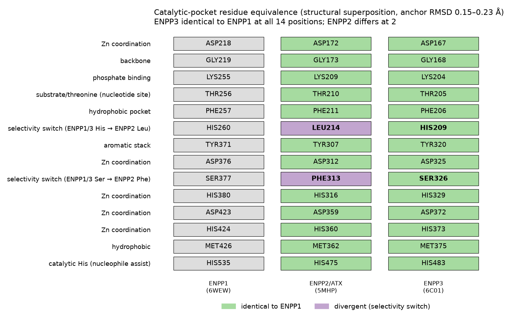

---

## Literature selectivity bar (what "good" looks like)

| Compound | ENPP1 IC50 | vs ENPP2 | vs ENPP3 | note |
|----------|-----------|----------|----------|------|
| ISM5939 (Insilico, clinical) | 0.63 nM | **>15,000×** | **>3,400×** | oral, IND-cleared; the bar |
| Enpp-1-IN-27 | 14.7 nM | ~410× | **~10×** | ENPP3 is the weak axis even for good compounds |
| STF-1623 | <2 nM Ki | — | >1,000× | ultralong residence time |

ENPP3 selectivity is the recurring field bottleneck — consistent with the 100%
core-pocket identity measured here. **Any nomination must be assayed against
ENPP3, not just ENPP2.**

---

## Where this sits in the field (benchmarked, verified)

Full analysis in **[BENCHMARK.md](BENCHMARK.md)** (key claims cross-checked to real PMIDs/DOIs in [`benchmark/literature_grounding.csv`](benchmark/literature_grounding.csv)) — grounded in 59 triaged PubMed
medicinal-chemistry papers, the complete ChEMBL bioactivity landscape for all three
paralogs, and 23 ENPP1 clinical trials, all queried programmatically and DOI-verified.

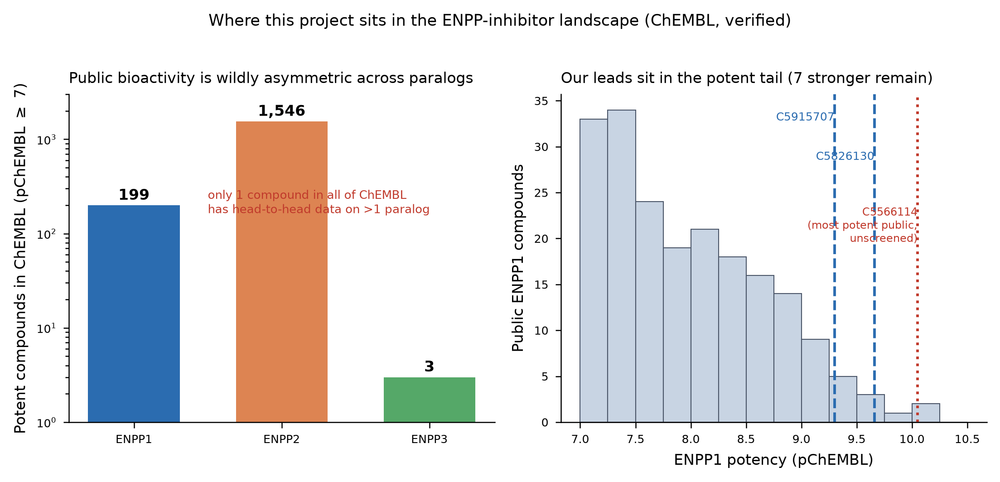

The single most important benchmark finding — and the reason this counter-screen is
worth doing — is the **data asymmetry** in ChEMBL (pChEMBL ≥ 7):

| Paralog | Potent compounds | Head-to-head selectivity data |
|---|---|---|
| ENPP2 / autotaxin | **1,546** | — |
| ENPP1 | **199** | — |
| ENPP3 | **3** | — |
| **Any compound tested on >1 paralog** | | **exactly 1 in all of ChEMBL** |

Public cross-paralog selectivity data barely exists. A structure-based counter-screen
is a rational way to generate selectivity *hypotheses* where assay data is absent.

**The field is ahead on potency and the clinic** (ISM5939: 0.63 nM, >3,400× ENPP3,
IND-cleared; four small-molecule ENPP1-inhibitor oncology programs in the clinic, two
now in Phase 2; a generative-AI-designed
oral inhibitor in *Nat. Commun.* 2025). We do not claim novel chemistry or a
candidate. **We build on that work** — the same open docking toolchain (smina/Vina +
Open Babel + RDKit) and the same 2024 biology that established ENPP3 as the second
cGAMP hydrolase (Li et al., *Cell Rep.*) — and add replicate statistics, a 4-method
consensus, mechanism analysis, and a systematic three-paralog comparison on top.

---

## Does the selectivity pattern generalize? (expanded screen)

We stress-tested the central finding on **7 additional, more-potent public ENPP1 inhibitors**
(pChEMBL 9.18–10.05, grounded live from ChEMBL) — which all turned out to be **phosphonates**,
a fourth warhead class beyond the original screen. Same receptors, same matched Zn boxes, same
protocol. Full detail in **[expanded_screen/README.md](expanded_screen/README.md)**.

The pattern holds and confirms the structural thesis: **ENPP2 discrimination is broadly
attainable** (mean margin +0.80 kcal/mol, ≥0 for all 7 — the two ENPP2 switch residues are
exploitable), while **ENPP1-vs-ENPP3 discrimination is hard** (mean −0.21, 3 of 7
anti-selective — the conserved pocket defeats metal-engaging warheads). The most potent
compound in the entire program (CHEMBL5566114, pChEMBL 10.05) is anti-selective vs ENPP3 —
**potency alone does not solve the hard selectivity axis.**

---

## Clinical competition & IP position (grounded, verified)

Full detail in **[clinical_ip/CLINICAL_IP_LANDSCAPE.md](clinical_ip/CLINICAL_IP_LANDSCAPE.md)**.
Trials pulled live from ClinicalTrials.gov; patents from PubChem compound→PatentID
cross-references (PUG-REST), each granted-patent number re-verified against the live
PubChem record.

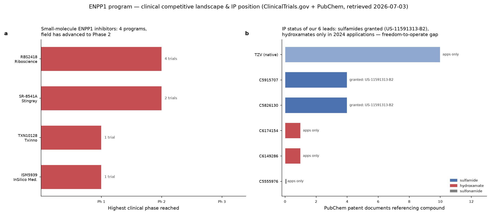

**Clinical (47 ENPP1-relevant trials).** The direct competitive set is four
small-molecule ENPP1-inhibitor immuno-oncology programs — RBS2418 (Riboscience) and
SR-8541A (Stingray) now in **Phase 2**, ISM5939 (InSilico) and TXN10128 (Txinno) in
Phase 1. A separate, larger block of rare-disease trials (Inozyme's INZ-701
enzyme-*replacement* program in GACI/ARHR2/PXE) targets ENPP1 *deficiency* — opposite
pharmacology, but it establishes ENPP1 as a clinically validated, druggable target.

**IP / freedom-to-operate.** The two sulfamide leads (CHEMBL5826130, CHEMBL5915707)
map to a **granted US composition-of-matter patent, US-11591313-B2**, plus two
continuation applications — validated chemotype, but occupied space. The hydroxamate
leads appear only in a single 2024 application (US-2024/0383893-A1) — more white space,
but the hydroxamate warhead carries the Zn-coordination liability this project's
mechanism analysis flagged as the driver of anti-selectivity. CHEMBL5555976
(sulfonamide) has no PubChem patent cross-reference at all. **Implication:** the AN10
piperidinol analog sits on the sulfamide scaffold — it inherits the granted-patent
precedent and therefore needs a composition defensibly distinct from US-11591313-B2.

*Docking is a directional selectivity proxy, not an IC50 ratio, and none of this is a
freedom-to-operate legal opinion — it is a programmatic reading of public patent
cross-references to orient the chemistry.*

---

## Extended analysis — does the call survive scrutiny?

The [`analysis/`](analysis/) directory stress-tests the headline ranking with
four orthogonal methods plus a rational analog-design campaign. Full write-up:
[`analysis/README.md`](analysis/README.md). A candid self-assessment of the whole
repo — including a defect we found and fixed — is in
[`quality_review.md`](quality_review.md).

**1. Statistical rigor (42-seed replicates + bootstrap).** The margins are no
longer n=1. Every ligand×target was docked 42 times; bootstrap CIs put each
verdict on a significance footing. Hydroxamates are significantly anti-selective,
both sulfamides significantly ENPP1-preferring, the sulfonamide indistinguishable
from zero.

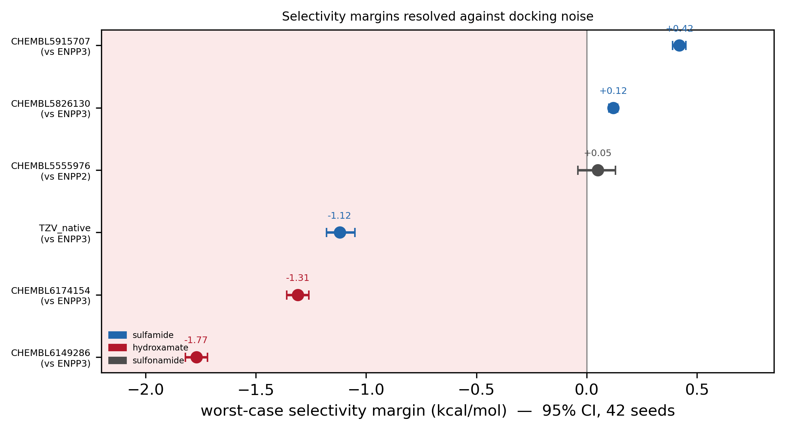

**2. The mechanism, measured.** The closest ligand-atom-to-catalytic-Zn distance
per pose explains *why*: hydroxamates and TZV directly coordinate the ENPP3 zinc
(1.7–2.2 Å) but not ENPP1's; sulfamides bind pocket walls, not metal — the
tunable surface.

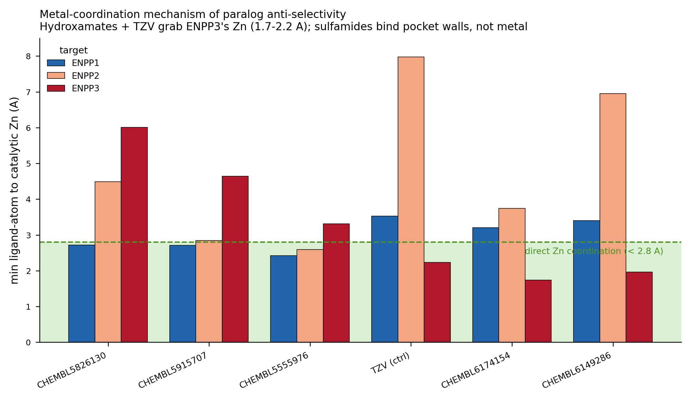

**3. Interaction fingerprints + consensus rescore.** The nominee contacts more
ENPP1 pocket residues than either paralog (energy-independent), and a second
scoring function (Vinardo) reproduces the hydroxamate anti-selectivity while
disagreeing on the small sulfamide margins — reported honestly.

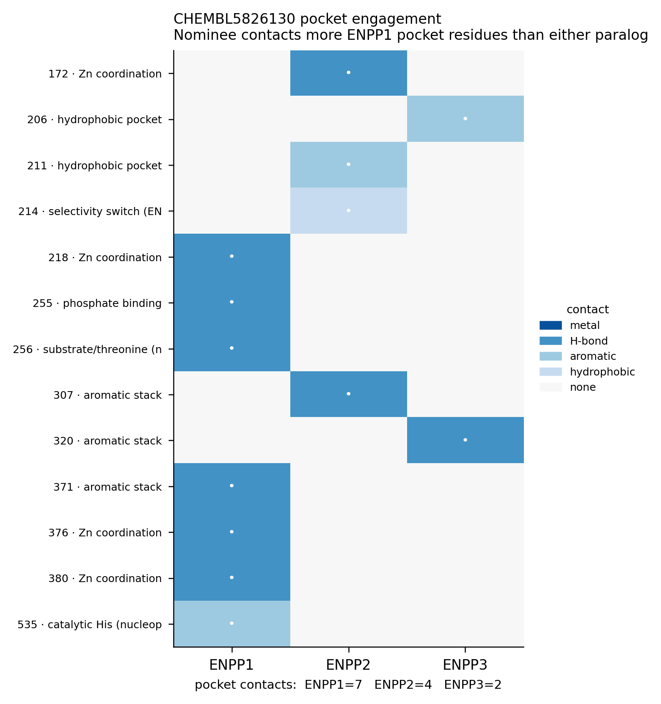
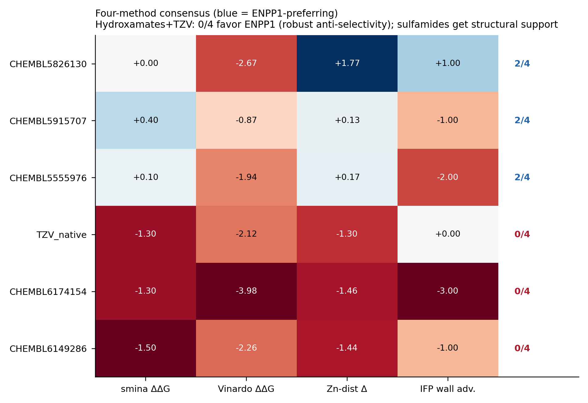

**4. Rational analog design.** 13 Ro5-clean analogs of CHEMBL5826130 designed to
exploit the ENPP2 switch residues; the best (a 3-hydroxy-piperidine variant)
improves the *predicted* margin while retaining potency and developability. A
synthesizable next iteration — predictions to be assayed, not conclusions.

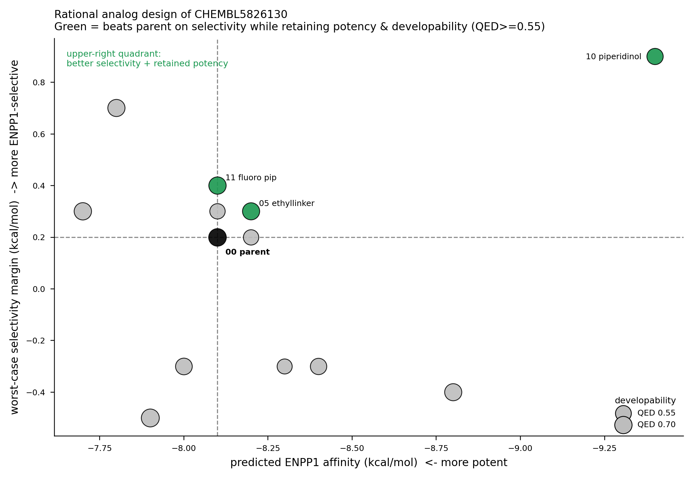

A focused 15-seed replicate validates the top analog: **AN10_piperidinol** improves
both predicted potency (ENPP1 −9.08 vs parent −8.10) and worst-case selectivity
margin (+0.70 [0.39, 0.95] vs +0.15), with the bootstrap CI excluding zero.

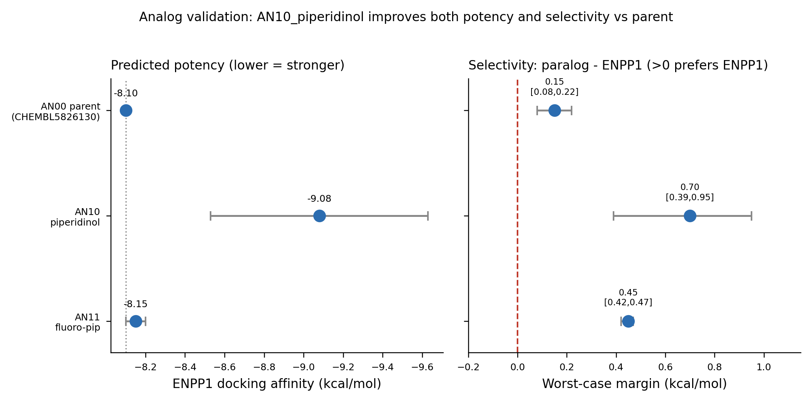

**5. Protocol validation suite.** Three controls calibrate how far the docking
protocol can be trusted on this target — a cognate redocking of the native
ligand, an actives-vs-decoys enrichment benchmark (an honest **negative**:
ROC-AUC 0.44, so absolute score does not rank binders — which is exactly why
only the *within-ligand* ENPP1-vs-paralog margin is used), and a
protonation-state robustness check (directional calls sign-robust over 8
states). Full detail in [`analysis/validation/`](analysis/validation/) and the
referee ledger [`REVIEWER_GAP_ANALYSIS.md`](REVIEWER_GAP_ANALYSIS.md).

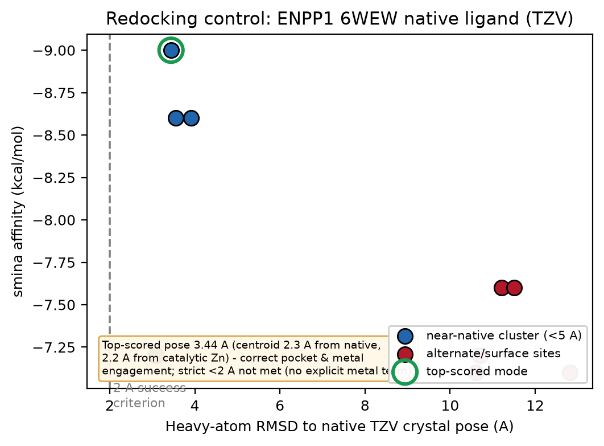
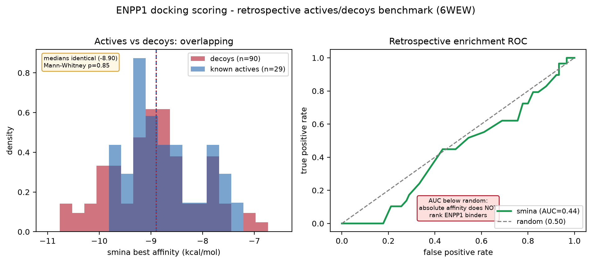
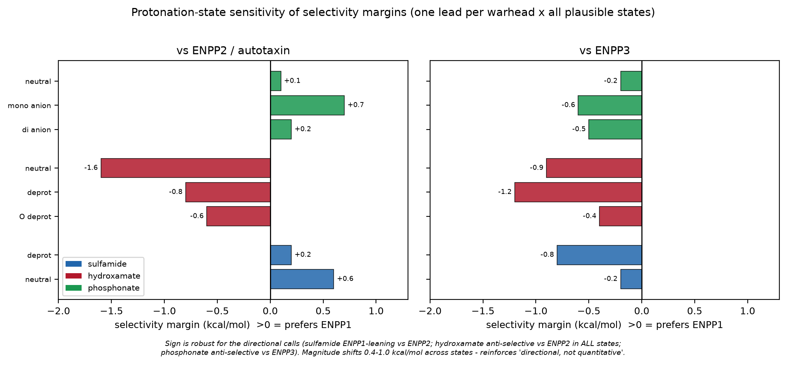

---

## Repository layout

```
enpp1-selectivity-repo/
├── README.md                         # this file
├── LICENSE                           # MIT (code); data provenance noted
├── requirements.txt                  # Python + external-tool deps
├── enpp_lead_recommendation.md       # full nomination memo
├── quality_review.md                 # adversarial self-assessment (grades + defect log)
├── BENCHMARK.md                      # positioning vs literature/competitors/open-source (verified)
├── benchmark/                        # grounded field benchmark (PubMed + ChEMBL + trials)
│   ├── benchmark_literature_full.csv # 59 DOI-linked ENPP1 medchem/selectivity/structure papers
│   ├── key_benchmarks.csv            # 7 landmark papers (crystal, AVA-NP-695, genAI, ENPP3-hydrolase)
│   ├── chembl_paralog_summary.csv    # potent-compound counts per paralog
│   ├── chembl_landscape.csv          # full ChEMBL bioactivity pull (pChEMBL>=7)
│   ├── clinical_trials.csv           # ENPP1-inhibitor trials (NCT IDs, phase, status)
│   └── fig_landscape_benchmark.png   # data-asymmetry + potency-distribution figure
├── clinical_ip/                      # clinical competition + patent/FTO reading (verified)
│   ├── CLINICAL_IP_LANDSCAPE.md      # trials + patent landscape + FTO reading
│   ├── clinical_trials_full.csv      # 47 ENPP1-relevant trials (NCT, phase, status, sponsor)
│   ├── patent_landscape.csv          # per-lead PubChem patent xrefs (granted + applications)
│   └── fig_clinical_patent_landscape.png  # competitive phase + per-lead IP figure
├── expanded_screen/                  # generalization test: 7 more-potent phosphonate inhibitors
│   ├── README.md                    # does the warhead->selectivity pattern hold on new chemotype?
│   ├── phosphonate_selectivity_scorecard.csv
│   ├── phosphonate_ligands.csv       # 7 leads, grounded QED/potency/Ro5
│   ├── phosphonate_docking_raw.csv
│   └── fig_phosphonate_selectivity.png
├── analysis/                         # extended rigor: replicates, mechanism, consensus, analogs
│   ├── README.md                     # methods for all four orthogonal analyses
│   ├── data/                         # replicate scores, bootstrap CIs, Zn distances, IFP, analogs
│   ├── figures/                      # 6 publication figures (CIs, Zn, IFP, consensus, analog design + validation)
│   └── scripts/                      # run_replicates.sh, rep_analogs_focused.sh, run_analysis.py
├── writeups/                         # long-form communication drafts
│   ├── substack_article.md           # ~2,000-word methods narrative (limitations-first)
│   ├── x_thread.md                   # 10-beat thread + pinned caveat
│   └── x_article.md                  # condensed long-form version
├── data/
│   ├── ligands.csv                   # 5 leads + native TZV: SMILES, warhead, QED, pChEMBL
│   ├── docking_scores_raw.csv        # long-form smina affinities (target,ligand,affinity)
│   ├── enpp_selectivity_scorecard.csv# margins + verdicts (regenerated by build_scorecard.py)
│   ├── enpp_active_site_conservation.csv  # 14-residue pocket equivalence
│   ├── enpp_paralog_structures.csv   # structure provenance (PDB, resolution, box centers)
│   ├── pocket_residues.json          # per-structure pocket residues + distance to Zn
│   └── conservation_map.json         # ENPP1↔ENPP2↔ENPP3 residue mapping
├── figures/
│   ├── enpp_selectivity.png          # heatmap + margin ranking
│   └── enpp_active_site_conservation.png
├── receptors/                        # prepared receptor PDBs (protonated, ligand/water stripped)
│   ├── enpp1_6wew_receptor.pdb
│   ├── enpp2_5mhp_receptor.pdb
│   └── enpp3_6c01_receptor.pdb
├── poses/                            # representative docked poses (PDBQT) for the flip
│   ├── dock_enpp{1,2,3}_CHEMBL5826130.pdbqt   # the nominee
│   └── dock_enpp{1,2,3}_CHEMBL6149286.pdbqt   # the demoted hydroxamate
└── scripts/
    ├── prepare_ligands.py            # SMILES → 3D → PDBQT (RDKit + obabel)
    ├── dock_all.sh                   # smina across 3 paralogs × 6 ligands
    ├── build_scorecard.py            # raw scores → scorecard + verdicts
    ├── reproduce.sh                  # end-to-end driver
    └── README.md                     # protocol notes
```

---

## Reproduce it

```bash
# 1. environment
mamba create -n enpp-dock -c conda-forge rdkit openbabel smina pandas numpy matplotlib seaborn
mamba activate enpp-dock

# 2. rebuild the scorecard from the committed raw scores (fast, no docking)
python scripts/build_scorecard.py

# 3. full re-dock from scratch (slower; needs receptors/*.pdbqt — see scripts/README.md)
bash scripts/reproduce.sh
```

The scorecard step reproduces `data/enpp_selectivity_scorecard.csv` exactly from
`data/docking_scores_raw.csv`. The full re-dock regenerates the raw scores;
because docking is stochastic (mitigated here by `--seed 42 --exhaustiveness
16`), scores may vary by ≈0.1–0.3 kcal/mol run to run — see the disclaimer.

---

## Methods (short)

- **Structures:** ENPP1 6WEW (2.73 Å, native sulfamide TZV), ENPP2/ATX 5MHP
  (2.43 Å), ENPP3 6C01 (2.30 Å, apo). Receptors protonated, ligands/waters
  stripped, converted to PDBQT.
- **Box:** 24 Å cube centered on the **catalytic-Zn centroid** of each enzyme
  (paralog-agnostic, so the comparison is apples-to-apples across all three).
- **Docking:** smina, `--exhaustiveness 16 --num_modes 5`. Best-mode affinity
  reported. Headline scores are **means of 42 independent runs** (seeds 1–20,
  42) per ligand×target; the seed-to-seed SD (0.05–0.29 kcal/mol, median 0.08)
  is the empirical noise floor, and margin significance is assessed by 10k-resample
  bootstrap (see [`analysis/`](analysis/)).
- **Ligands:** RDKit ETKDGv3 embed (seed 42) + MMFF optimization, Gasteiger
  charges via obabel.
- **Conservation:** custom Kabsch superposition on 7 conserved anchor residues;
  pocket = residues within 6 Å of the Zn pair.

Full rationale and next-step design in
[`enpp_lead_recommendation.md`](enpp_lead_recommendation.md).

---

## DISCLAIMER

**This repository contains no experimental data and makes no therapeutic claim.**

- Docking ΔΔG is a **directional triage proxy, not an IC50 ratio**. A +0.42
  kcal/mol margin is *statistically* resolved (42-seed bootstrap) but is *not* a
  selectivity fold-change. smina scoring does not model metal-coordination
  quantum chemistry well. The counter-screen *correctly flags direction*
  (hydroxamates promiscuous, sulfamides ENPP1-leaning) but the numbers cannot be
  quoted as selectivity ratios. A second scoring function (Vinardo) agrees on
  the hydroxamate anti-selectivity but *disagrees* on the sign of the small
  sulfamide margins — so the developable-lead selectivity edge is directionally
  suggestive, not scoring-function-robust (see `analysis/consensus_selectivity.csv`).
- **Protonation-state sensitivity.** Docking all plausible protonation/tautomer
  states of one lead per warhead (8 states x 3 paralogs) leaves the directional
  selectivity calls sign-robust (sulfamide ENPP1-leaning vs ENPP2; hydroxamate
  anti-selective vs ENPP2 in every state; phosphonate anti-selective vs ENPP3 in
  every state) while margin magnitudes move 0.4-1.0 kcal/mol — larger than the
  seed-noise CIs, reinforcing that margins are directional, not quantitative.
  See `analysis/validation/PROTOMER_README.md`.
- **Retrospective enrichment (calibration).** Docking 30 known ENPP1 actives
  (pChEMBL >=7) against 90 property-matched decoys into 6WEW gives ROC-AUC 0.44
  (below random); absolute smina affinity does **not** rank ENPP1 binders. This
  is why **no cross-chemotype absolute-affinity claim is made**. The selectivity
  margins survive this because they use the *within-ligand* ENPP1-vs-paralog
  score *difference* (ddG), where ligand-specific scoring errors largely cancel
  — a different and more forgiving quantity than the absolute ranking that
  fails here. See `analysis/validation/ENRICHMENT_README.md`.
- **Protocol validation (cognate redocking).** Redocking the native 6WEW
  ligand TZV with the identical protocol reproduces the correct sub-pocket and
  catalytic-Zn engagement (top-scored pose 2.3 A centroid / 2.2 A Zn distance
  from native) and separates pocket poses (3-4 A) from surface decoys
  (10-13 A), but does **not** meet the strict <2 A RMSD success criterion
  (best mode 3.08 A, top-scored 3.44 A). The residual error is in the
  metal-chelation geometry — expected for a Vina-type function with no explicit
  metal term. This bounds what the study claims: pocket-level discrimination is
  resolvable; sub-2 A pose accuracy and fine ranking between similar chelators
  are not. See `analysis/validation/`.
- ENPP3 (6C01) was docked apo; poses were not MD-relaxed; no explicit
  metal-coordination restraints were applied.
- pChEMBL/QED are database and cheminformatic properties, not measured potencies
  in this assay context.
- The decisive experiment is a wet-lab **3-enzyme ENPP1/2/3 biochemical panel**.
  Everything here is hypothesis-generating until those IC50s exist.

Not affiliated with, or endorsed by, any company or clinical program named for
comparison. Structures and bioactivities belong to their respective sources
(RCSB PDB; ChEMBL, CC BY-SA 3.0).

## Citation

If this workflow is useful, cite the repository and the underlying data sources
(RCSB PDB entries 6WEW/5MHP/6C01; ChEMBL). A `CITATION.cff` can be added on
first release.
